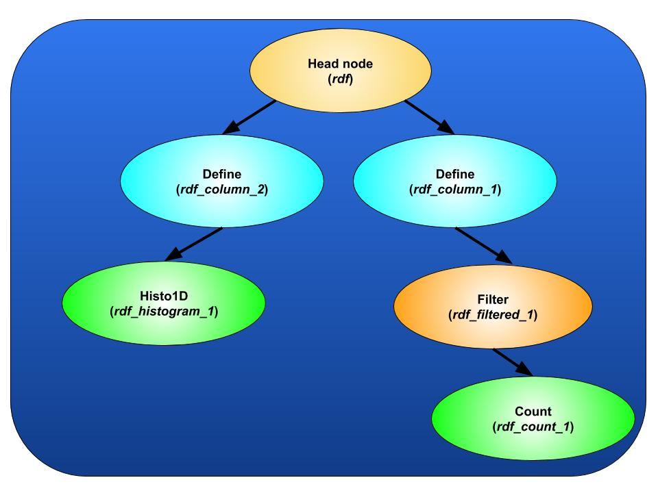

# Google Summer of Code 2018 - Report
<hr/>
## Distributed Big Data Analysis with RDataFrame
<hr/>

Introduction
------------

A Python package named 'PyRDF' was built on top of [ROOT’s RDataFrame](https://root.cern/doc/master/classROOT_1_1RDataFrame.html), that makes it seamless to run RDataFrame operations with any distributed backend and without much effort. PyRDF internally creates a computational graph of all requested operations and executes it using [PyROOT](https://root.cern.ch/pyroot), only when required. Without this Python layer, one has to write a mapper function, a reducer function and manually set up a distributed environment (like Spark) to execute the operations on clusters. PyRDF also allows you to create your own backend to execute RDataFrame operations.

Features 
--------

* ### Execute [ROOT](https://root.cern.ch/) operations on Spark clusters without a mapper and a reducer function
	- Spark usually expects you to give in a mapper and a reducer function for it to run a job. With PyRDF, all you need to do is to choose 'spark' as your desired backend and `PyRDF` does the rest for you. 
	- For example,  

```python 
import PyRDF

# This is the only extra statement.
PyRDF.use('spark')

# Or you can also add configuration parameters.
PyRDF.use('spark', {'npartitions':4, 'spark.executor.instances':5})

### All of your operations here
```
* ### Including C++ header files through `PyRDF.include` interface
	- If you want to make use of a C++ function as a part of an operation, then you can declare the function in a separate file and include it using `PyRDF.include`. 
	- `PyRDF.include` takes in a list of paths or a single path and it declares those files before execution, using ROOT interpreter.
	- For example, if you've declared a function named `fun` inside `A.cpp`, this is how you should make use of the function :  

```python
import PyRDF

PyRDF.use('spark')
PyRDF.include("/path/to/A.cpp")

rdf = PyRDF.RDataFrame(10)

# Notice the function call inside 'Filter' here. 'tdfentry_'
# here represents each integer in the RDataFrame range, i.e., between
# 0 to 9. Remember that your C++ function should always return a
# boolean for 'Filter' to work.
rdf_filtered = rdf.Filter("fun(tdfentry_)")

### Rest of the processing here.
```
	- Note that you can include header files anytime before the start of execution. That means, you can include them even after defining operations !

* ### Run ROOT operations in multithreaded mode in your local environment
	- `PyRDF` also supports running ROOT operations in multithreaded mode. All you have to do is add the following statement before start of computation : `ROOT.ROOT.EnableImplicitMT()`.

Installation procedure
----------------------

* Install ROOT library. It is recommended to install the most recent version of ROOT. Nonetheless, the installed version of ROOT at least has to be `6.15/01`.


* You can find ROOT installation instructions here : [https://root.cern.ch/building-root](https://root.cern.ch/building-root)


* If you’re using Python 2, install enum34 as well
	* `pip install enum34`  
  

* Clone PyRDF from github
	* `git clone https://github.com/shravan97/PyRDF`  
  

* Install PyRDF
	* `python setup.py install`  

Usage
-----

PyRDF has a very simple and intuitive programming model. Here are the 5 simple steps you need to follow to get started with PyRDF :

* Step 1 : Import `PyRDF` package
* Step 2 : Choose your backend (this could be ‘local’, ‘spark’ or your own backend)
* Step 3 : Define a RDataFrame object
* Step 4 : Define all of your operations
* Step 5 : Display your output

This is how you convert the above steps into code :

```python
import PyRDF

# Choose your backend
PyRDF.use('spark')

# Initialize a RDataFrame object
rdf = PyRDF.RDataFrame(...args...)

# Define your operations
rdf_op = rdf.Define(...)
rdf_filtered = rdf_op.Filter(...)
my_histogram = rdf_filtered.Histo1D(...)

# Simply Display your required output
my_histogram.Draw()
```

### Explanation of the steps
#### Step 1 : Importing `PyRDF`
Importing the `PyRDF` package is as simple as :
```python
import PyRDF
```

Another option here would be to import a particular module or class from `PyRDF`, like this : 
```python
from PyRDF import RDataFrame
```

#### Step 2 : Choosing your backend
The right way to choose a backend is using the `PyRDF.use` method.
```python
import PyRDF
PyRDF.use('spark')
```
In the current release, 'local' and 'spark' are the only 2 available backends. More built-in backends and user defined backends will be available in future releases. If you don't choose a backend using `PyRDF.use`, the default backend choice would be 'local'.

**Some points to note**
 * If you choose a backend using `PyRDF.use`, you have to do it before making an operation calls to the `RDataFrame` object. Otherwise, it might result in a run-time error.

```python
import PyRDF

#### This is wrong 
rdf = PyRDF.RDataFrame(...args...)
rdf_filtered = PyRDF.Filter(...)
my_histogram = rdf_filtered.Histo1D(...)
PyRDF.use('spark')

#### This is correct 
PyRDF.use('spark')
rdf = PyRDF.RDataFrame(...args...)
rdf_filtered = PyRDF.Filter(...)
my_histogram = rdf_filtered.Histo1D(...)
```

* If you don't want to switch between backends, always make it a point to select the backend right after importing `PyRDF`.
* If you want to work in your local environment only, then you don't have to include the `PyRDF.use` statement.
* `PyRDF.use` also accepts a configuration dictionary (named `config`) along with the backend name. Refer to the user documentation for more information.

#### Step 3 : Create a RDataFrame instance
The RDataFrame constructor for PyRDF is same as that of PyROOT’s. Hence you can refer to [PyROOT’s RDataFrame documentation](https://root.cern/doc/master/classROOT_1_1RDataFrame.html#a0813d17002d46c962513acb96ddc8d57) for information regarding the constructor. There are also some additional cases that the PyRDF’s RDataFrame constructor supports. Refer to the user documentation for more information.  
Here are some examples for creating `RDataFrame` instances : 
```python
import PyRDF
# Example 1
rdataframe_1 = PyRDF.RDataFrame(10)

# Example 2
rdataframe_2 = PyRDF.RDataFrame("myTreeName", "/path/to/my/root/file")

# Example 3
rdataframe_3 = PyRDF.RDataFrame("myTreeName", "http://example.com/file.root")

# Example 4
rdataframe_4 = PyRDF.RDataFrame("myTreeName", ["file1.root", "file2.root"])

```

#### Step 4 : Define your operations
The operations that you can perform depends on the backend that you choose. For example, `Range` works only in the 'local' backend and not any distributed backend. You can find out the list of operations supported by : 
```python
import PyRDF
PyRDF.use('spark')

# This will print the list of supported operations
print(PyRDF.current_backend.supported_operations)
```
* Operations are classified into *actions* and *transformations*. You can find the available transformations and actions in [PyROOT’s RDataFrame documentation](https://root.cern/doc/master/classROOT_1_1RDataFrame.html).

* All the defined operations create a *__computational graph__*. Take a look at the example below that illustrates how a series of operations are converted into a computational graph.

##### Defined operations
```python
import PyRDF

# Initialize a RDataFrame object
rdf = PyRDF.RDataFrame(...args...)

# Define your operations
rdf_column_1 = rdf.Define(...) # Transformation
rdf_column_2 = rdf.Define(...) # Transformation
rdf_filtered_1 = rdf_column_1.Filter(...) # Transformation
rdf_count_1 = rdf_filtered_1.Count(...) # Action
rdf_histogram_1 = rdf_column_2.Histo1D(...) # Action
```
##### Computational graph


#### Step 5 : Get and display the results
After you define all the operations, execution will not happen until you make a method call on a `Proxy` object. For example : 
```python
import PyRDF

# Initialize a RDataFrame object
rdf = PyRDF.RDataFrame(...args...)

# Operations
rdf_histogram = rdf.Histo1D(...)

my_histogram_value = rdf_histogram.GetValue() # Computation happens here 


```

* You can apply all the (non-dunder) methods on a proxy object that you would apply on the output value as well. For example, on a `Histo1D` proxy object, you can apply functions like `Draw`, `GetEntries`, `GetMean` ... etc. 
* If you instead want a reference to the actual value instead of proxy, you use `GetValue`. In the above code snippet, `my_histogram_value` would refer to the actual `ROOT.TH1D` object. In the cases where the output is supposed to be an integer, you'd get a value of the `int` type on a `GetValue` call.

Information on different backends
-----------------------------
### Local backend
* The local backend runs all the computation in your local system.
* After execution in the local backend, the computed values as well as the `RResultPtr`s (or PyROOT result proxies). This is done because, the values held by RResultPtrs will not be in memory and will go out of scope if we don't store the RResultPtrs.
* In local backend, you can also enable multithreading if you wish to. You can do that by running `ROOT.ROOT.EnableImplicitMT()`. You can disable it by `ROOT.ROOT.DisableImplicitMT()`.
* Note that "Range" operation isn't supported in multithreading enabled environments.
* Since local backend is the default backend, you don't have to do `PyRDF.use('local')`. Although, doing that will not be of any harm.

### Spark backend
* Spark backend is chosen by running `PyRDF.use('spark')`.
* You can additionally pass in a configuration dictionary to the `PyRDF.use()` function. For example, you can run `PyRDF.use('spark', {'npartitions':4})`. The 'npartitions' parameter refers to the number of parts to divide the input dataset into.
* The configuration dictionary accepts only 'npartitions' and all Spark configuration parameters. For Spark configuration parameters, refer to [Spark docs](https://spark.apache.org/docs/latest/configuration.html).
* Note that, if the value of 'npartitions' is not set in the config dictionary, then it will be set to the value of `spark.executor.instances` from the config dictionary. If `spark.executor.instances` is also not set in the config dictionary, then `npartitions` will be set to `2`.
* You can also make a `SparkContext` directly available for use. In such cases, the existing `SparkContext` would be **directly used, even if you pass in configuration parameters**.
* If you want to run Spark with your own configuration parameters and you're not sure whether a `SparkContext` already exists, then simply run the following before running `PyRDF.use` :  

```python
from pyspark import SparkContext
sc = SparkContext.getOrCreate()
sc.stop()

```

Demos
-----
Refer to [https://github.com/shravan97/PyRDF/tree/master/demos](https://github.com/shravan97/PyRDF/tree/master/demos) sample Jupyter notebooks.

Tutorials
---------
You can access the tutorials here : 
[https://github.com/shravan97/PyRDF/tree/master/tutorials](https://github.com/shravan97/PyRDF/tree/master/tutorials)  
The tutorials are divided based on the backend they use.

Documentation
-------------

### User reference

### Developer reference
Refer to the developer docs here : 
[http://shravanmurali.com/PyRDF/Developer](http://shravanmurali.com/PyRDF/Developer)

Possible future improvements
----------------------------

* Make PyRDF available for use on [SWAN](https://swan.web.cern.ch/)
* Integrate PyRDF with PyROOT’s RDataFrame
* Allow users to pass a `Backend` instance to `PyRDF.use`
* Add support for accepting C++ mapper functions

Quick links
-----------

* [PyRDF Github](https://github.com/shravan97/PyRDF/)
* [RDataFrame Docs](https://root.cern/doc/master/classROOT_1_1RDataFrame.html)
